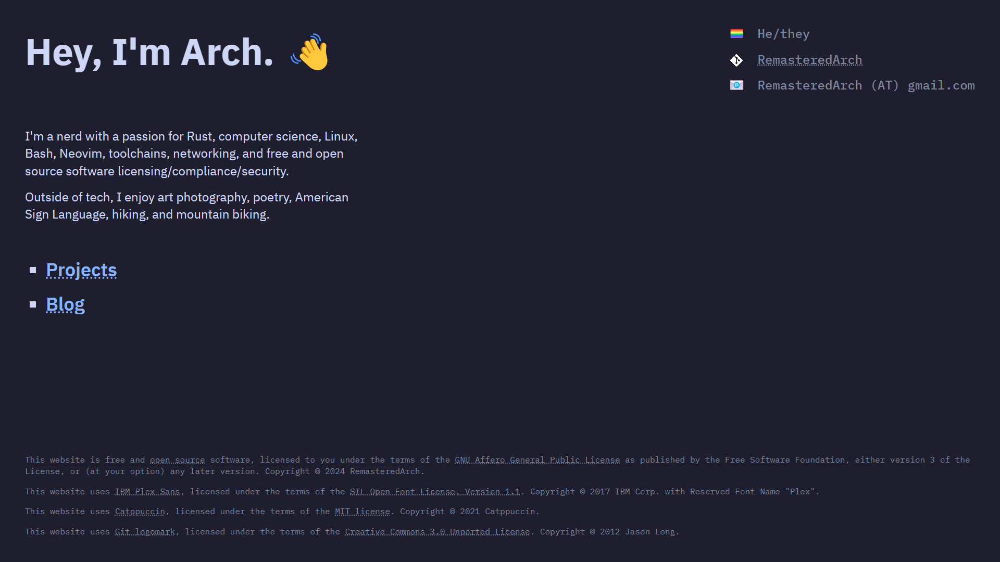

# `remasteredarch.net`

The repository for my personal website.

It is almost ready for prime time.
I need to work on improving blog metadata
--- tag linking, add supprt for multiple blog authors, and show metadata on blog pages ---
and add a CI/CD script.

## License

`remasteredarch.net` is licensed under the GNU Affero General Public License version 3, or (at your option) any later version.
You should have received a copy of the GNU Affero General Public License along with `remasteredarch.net`, found in [LICENSE](./LICENSE).
If not, see <https://www.gnu.org/licenses/>.
