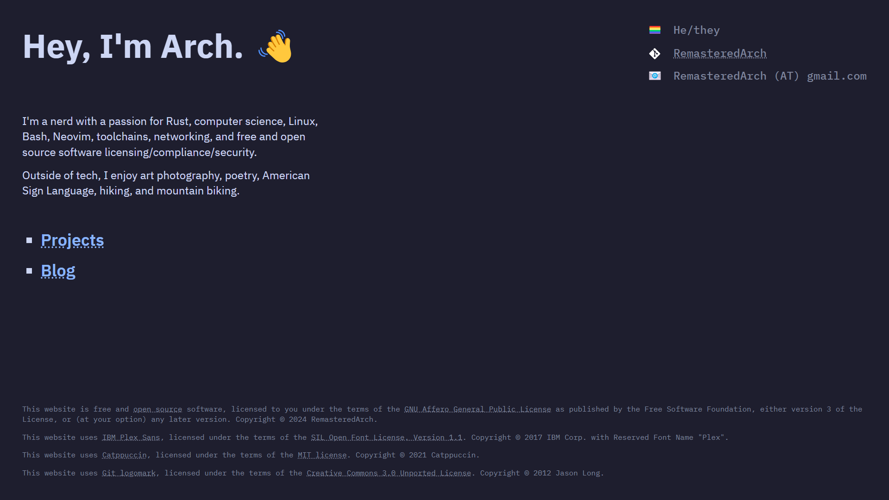

# `remasteredarch.net`

The repository for my personal website,
written from scratch with [Astro](https://astro.build/).

## License

`remasteredarch.net` is licensed under the GNU Affero General Public License version 3, or (at your option) any later version.
You should have received a copy of the GNU Affero General Public License along with `remasteredarch.net`, found in [LICENSE](./LICENSE).
If not, see <https://www.gnu.org/licenses/>.
