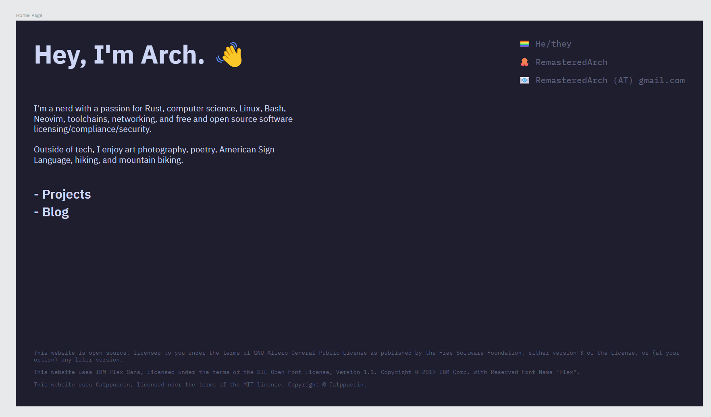

Back in early 2021, I was dissatisfied with the personal website that I had built with [Carrd](https://carrd.co/).
Though I had always had an interest in computers, I had never made the leap to programming.
But when I found this GitHub Pages thing, I decided it might make for an "interesting project."
I learned some HTML and CSS, and created something I was quite proud of.
Once I had learned more, I came back and rewrote it, now with some neat styling.
By the end of 2021, I decided would learn some _real_ programming with this JavaScript thing.
In January of 2022, I finished and uploaded my last rewrite,
incorporating a few bits of JavaScript
(some of which was [truly horrifying](https://github.com/RemasteredArch/remasteredarch.github.io/blob/0f5287c/pages/pascGen.html#L105-L138))
and even more advanced HTML and CSS.

I don't think that I had any idea what I started back then.
Since then, I have
advanced significantly as a programmer,
garnered quite a collection of knowledge and skills,
built and helped build cool things,
attended awesome events,
and met many amazing people.
It has been an incredibly fulfilling journey,
and I'm excited to do it for the rest of my life.

Let's get onto this new website.

## Getting Start with the Rewrite

Though I started with the web, nowadays I just write Rust for the Linux command line.
Accordingly, I did not have a particular technology in mind.
I did know a few things:

-   I wanted it to be generated.
    My last website was 100% handmade, but now that I have more experience,
    I didn't want to duplicate code and I had the know-how to use a framework or generator.
-   I wanted it to be _statically_ generated.
    I didn't need any dynamic content, so server-side rendering would've been pointless,
    and static hosting is cheaper, easier, faster, and more secure.
-   I wanted to ship as little JavaScript as possible.
    I wanted a simple and fast website,
    and not the interactivity that most frameworks are built for.
    That meant I wanted a framework that did as much as it could at compile time,
    not frameworks that ship lots of client-side JavaScript.

I wasn't sure what would suit my needs,
but I had been keeping my eye on the web development world, so I had a few ideas:

-   A handmade home page with a static site generator with a custom theme for the blog.
    I considered
    [Zola](https://www.getzola.org/),
    [Cobalt](https://cobalt-org.github.io/),
    [Eleventy](https://www.11ty.dev/),
    [Hugo](https://gohugo.io/),
    and [Jekyll](https://jekyllrb.com/).
-   An HTML template engine,
    like [Parcel](https://parceljs.org/)
    with [PostHTML's Include Plugin](https://github.com/posthtml/posthtml-include).
-   A JSX-based static site generation framework like
    [Astro](https://astro.build/)
    or [Next.js](https://nextjs.org/).

Eventually, I decided that I would get the ball rolling with design,
then implement the home page with plain HTML and CSS,
and then finally pick a generator and transition over to it.

## Design

I did the design work with [Penpot](https://penpot.app).
I remembered having mixed feelings in the past,
but I quite enjoyed it this go around.

I knew I wanted a few things:

-   The header "Hey, I'm Arch. 👋"
-   A prominent link to my GitHub account
-   A basic summary pertaining to my interests, particularly technical
-   My pronouns
-   A pride flag
-   A proper legal notice
-   A list of my projects
-   A list of my blog posts

The last two didn't work out
--- I wasn't going to be able to have two arbitrarily long lists on a mobile device.
I just pushed them off onto their own pages, and I think it turned out better for it.

The only single source of inspiration I can point to, other than my previous website,
was <https://www.fantail.dev/>.
The site has since changed and the Internet Archive doesn't have a capture with CSS,
but here's the rough layout to my memory:

```text
Name            - Contact
Blurb           - Contact

Project  Project  Project
Project  Project  Project

     Legal Footer
```

The only inspiration I took can be seen in the header,
with the big heading text on the left and the list of contacts on the right.

Here's the final draft I created with Penpot before I got to implementation.
It was pretty close to how it ultimately came out,
other than adding link styling, a different icon for my GitHub account, and a brighter color for the subtle text.



## The First Home Page

## Transitioning to Astro

## Expanding the Site

## Release

## Conclusion
